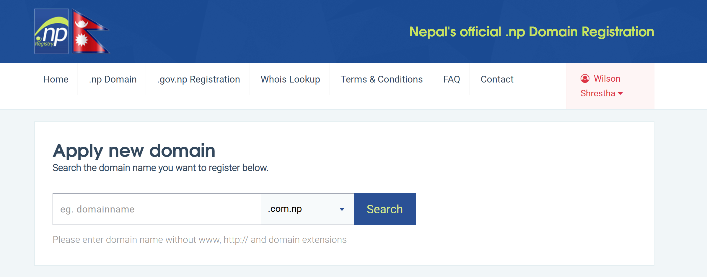
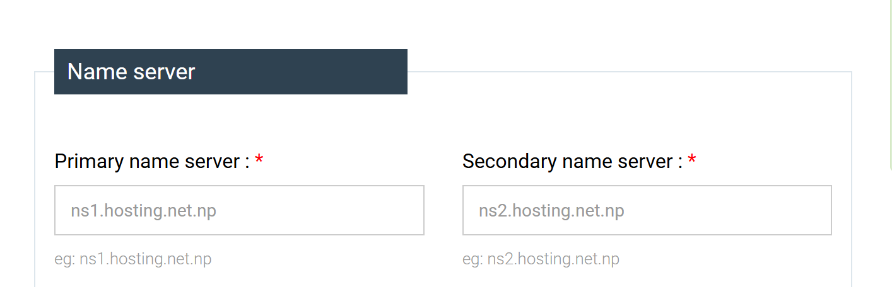

# Registering .com.np Domain name in Nepal for free

- Register your email in [Official Nepal Domain Registry](https://register.com.np/)

- Apply new domain and it should be your name like wilsonshrestha.com.np (*Note: You can't use numbers or special characters in between except '-' and your domain name should match your actual name in the Citizenship document* )

 

- Paste your desired nameservers. It can be any DNS provider like Cloudflare

- Paste these if you want to use Cloudflare DNS:

  katelyn.ns.cloudflare.com
  kurt.ns.cloudflare.com

- Create and upload Cover letter asking for the permission of the domain and upload your Citizenship document. Both needs to be in jpg format. Actually upload additional documents like Passport, NID and Voter ID Card just to be safe because they seem to have tighten their security and want all the documents that prove that its really you.

